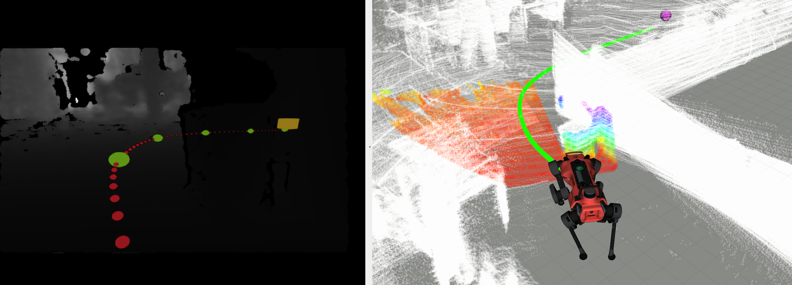

# Visual Imperative Planner (VIPlanner)

## Overview

Imperative learning based visual local planer using front depth image

**Keywords:** Visual Navigation, Local Planning, Imperative Learning

### License

This code belongs to Robotic Systems Lab, ETH Zurich. 
All right reserved

**Author: Fan Yang 
Maintainer: Fan Yang, fanyang1@ethz.ch**

The VIPlanner package has been tested under ROS Noetic on Ubuntu 20.04.
This is research code, expect that it changes often and any fitness for a particular purpose is disclaimed.

  

## Installation

#### Dependences:

To run VIPlanner, you need to install [PyTorch](https://pytorch.org/). Hence, we recommand to use [Anaconda](https://docs.anaconda.com/anaconda/install/index.html) for installation. Check the offitial website for installtion Ananconda and PyTorch accoordingly.

Additionally, to enable visualization of VIPlanner, you need to install [PyPose](https://pypose.org/). Check the offitial website for installation.

#### Building

To build the repo and set up the right python version for running, use the command below:

    catkin build <package name> -DPYTHON_EXECUTABLE=$(which python3)

The python3 should be the python version you set up before with Torch and PyPose (Optional) ready. If using Anaconda environment, activate the conda env and check 

    which python

The VIPlanenr package name

    viplanner_node

## Usage

Run the VIPlanner without visualization:

	roslaunch vi_planner_node vi_planner.launch 

Run the VIPlanner with visualization

    roslaunch vi_planner_node planner_viz.launch

## Config files

Config file: config/

* **default.yaml** The config file contains:
    - **`main_run_hz`**  The ROS node running frequence
    - **`min_step_range`** The min steps range to record registration points for frame transformation from GPS frame to Odom frame
    - **`wp_step_range`** The steps range between two recorded GPS waypoints 
    - **`sesenor_offsets`** The offsets of sensor w.r.p the robot base
    - **`registter_points`** The number of points required for frame registation
    - **`visual_ratio`** The scale ratio for Rviz visualization
    - **`converge_range`** The converage range for navigaton destination
    - **`file_name`** The file name of waypoints file

