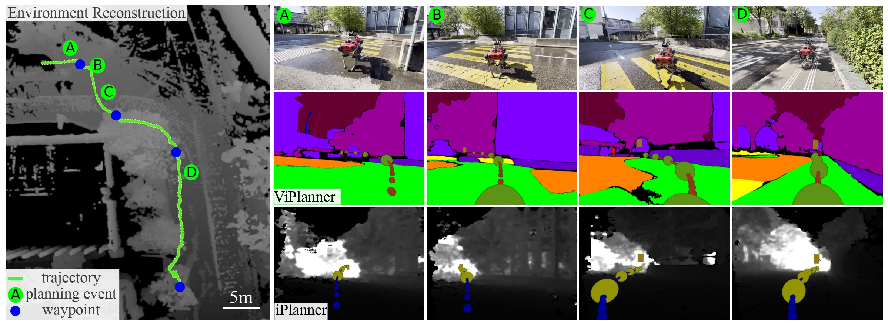

# ViPlanner: Visual Semantic Imperative Learning for Local Navigation

<p align="center">
  <a href="https://arxiv.org/">arXiv</a> •
  <a href="https://bowenc0221.github.io/mask2former">Video</a> •
  <a href="#CitingViPlanner">BibTeX</a>

  Click on image for demo video!
  [](https://drive.google.com/file/d/1yp500O5tlA1fLLQs0z8a-WxCDsnKwDCl/view?usp=sharing)
  
</p>

ViPlanner is a robust learning-based local path planner based on semantic and depth images.
Fully trained in simulation, the planner can be applied in dynamic indoor as well outdoor environments.
We provide it as an extension for [NVIDIA Isaac-Sim](https://developer.nvidia.com/isaac-sim) within the [Orbit](https://github.com/leggedrobotics/orbit/tree/dev/pascal/anymal-vip) project.
Furthermore, a ready to use [ROS Noetic](http://wiki.ros.org/noetic) package is available within this repo for direct integration on any robot (tested and developed on ANYmal C and D).

**Keywords:** Visual Navigation, Local Planning, Imperative Learning


## Install

- Install `pyproject.toml` with pip by running: 
  > pip install .
  
  or
  > pip install -e .

   if you want to edit the code

**Extension** This work includes the switch from semantic to direct RGB input for the training pipeline, to facilitate further research. For RGB input, an option exist to employ a backbone with mask2former pre-trained weights. For this option, include the github submodule, install the requirements included there and build the necessary cuda operators. All of that is not necessary for publish planner!

```bash
pip install git+https://github.com/facebookresearch/detectron2.git
git submodule update --init
pip install -r third_party/mask2former/requirements.txt
cd third_party/mask2former/mask2former/modeling/pixel_decoder/ops \
sh make.sh
```


**Remark**
Note that for an editable install for packages without setup.py, PEP660 has to be fulfilled. This requires the following versions (as described [here](https://stackoverflow.com/questions/69711606/how-to-install-a-package-using-pip-in-editable-mode-with-pyproject-toml) in detail)
- [pip >= 21.3](https://pip.pypa.io/en/stable/news/#v21-3)
	> python3 -m pip install --upgrade pip
- [setuptools >= 64.0.0](https://github.com/pypa/setuptools/blob/main/CHANGES.rst#v6400)
	> python3 -m pip install --upgrade setuptools

## Training

Here an overview provides an overview of the steps involved in training the policy.
For more detailed instructions, please refer to [TRAINING.md](TRAINING.md).

0. Training Data Generation <br>
Training data is generated from the [Matterport 3D](https://github.com/niessner/Matterport), [Carla](https://carla.org/) and [NVIDIA Warehouse](https://docs.omniverse.nvidia.com/isaacsim/latest/tutorial_static_assets.html) using developed Isaac Sim Extension, that are open-sourced [TODO ADD LINK]. For further information, please check this repo.

1. Build Cost-Map <br>
The first step in training the policy is to build a cost-map from the available depth and semantic data. A cost-map is a representation of the environment where each cell is assigned a cost value indicating its traversability. The cost-map guides the optimization, therefore, is required to be differentiable. Cost-maps are built using the [cost-builder](viplanner/cost_builder.py) with configs [here](viplanner/config/costmap_cfg.py), given a pointcloud of the environment with semantic information (either from simultion or real-world information).

2. Training <br>
Once the cost-map is constructed, the next step is to train the policy. The policy is a machine learning model that learns to make decisions based on the depth and semantic measurements. An example training script can be found [here](viplanner/train.py) with configs [here](viplanner/config/learning_cfg.py)

3. Evaluation <br>
Performance assessment can be performed on simulation and real-world data. The policy will be evaluated regarding multiple metrics such as distance to goal, average and maximum cost, path length. In order to let the policy be executed on anymal in simulation, please refer to the implementation as part of the [Orbit Framework](https://github.com/leggedrobotics/orbit/tree/dev/pascal/anymal-vip)


## Inference

1. Real-World <br>

	ROS-Node is provided to run the planner on the LeggedRobot ANYmal, for details please see [ROS-Node-README](ros/README.md).

2. NVIDIA Isaac-Sim <br>

	The planner can be executed within Nvidia Isaac Sim. It is implemented as part of the [Orbit Framework](https://github.com/leggedrobotics/orbit/tree/dev/pascal/anymal-vip/source/extensions/omni.isaac.anymal/omni/isaac/anymal/viplanner) incl. a new ANYmal extension, as available [here](https://github.com/leggedrobotics/orbit/tree/dev/pascal/anymal-vip/source/extensions/omni.isaac.anymal). For details on how to employ it, please refer to the Orbit Documentation.

### Model Download
The latest model is available to download: [[checkpoint](https://drive.google.com/file/d/1PY7XBkyIGESjdh1cMSiJgwwaIT0WaxIc/view?usp=sharing)] [[config](https://drive.google.com/file/d/1r1yhNQAJnjpn9-xpAQWGaQedwma5zokr/view?usp=sharing)]

## <a name="CitingViPlanner"></a>Citing ViPlanner
```
@misc{roth2023viplanner, 
    author={Pascal Roth, Julian Nubert, Fan Yang, Mayank Mittal, and Marco Hutter}, 
    title={ViPlanner: Visual Semantic Imperative Learning for Local Navigation}, 
    year={2023},
    eprint={2302.11434}, # TODO: update when published
    archivePrefix={arXiv},
    primaryClass={cs.RO}
} 
```

### License

This code belongs to Robotic Systems Lab, ETH Zurich.
All right reserved

**Author: [Pascal Roth](https://github.com/pascal-roth), [Julian Nubert](https://juliannubert.com/), [Fan Yang](https://github.com/MichaelFYang), [Mayank Mittal](https://mayankm96.github.io/), and [Marco Hutter](https://rsl.ethz.ch/the-lab/people/person-detail.MTIxOTEx.TGlzdC8yNDQxLC0xNDI1MTk1NzM1.html)<br />
Maintainer: Pascal Roth, rothpa@ethz.ch**

The ViPlanner package has been tested under ROS Noetic on Ubuntu 20.04.
This is research code, expect that it changes often and any fitness for a particular purpose is disclaimed.
